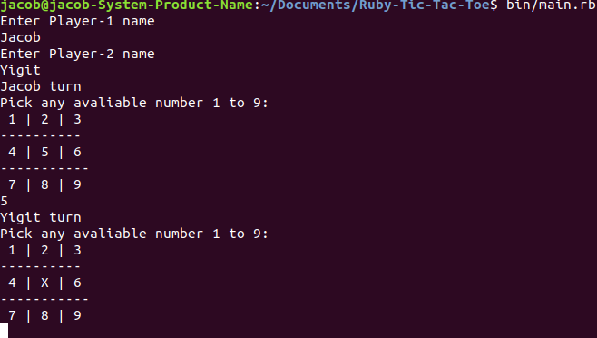

# Ruby Tic Tac Toe

This project is a challenge to build a Tic Tac Toe game using Ruby, this is part of the *Microverse Remote Software Development Curriculum*.

### Ruby Tic Tac Toe Screenshot:

## How to play Tic Tac Toe

In order to win the game, a player must place three of their marks in a horizontal, vertical, or diagonal row.

The following example game is won by the first player, X:

For more information: [wikipedia-tic-tac-toe article](https://en.wikipedia.org/wiki/Tic-tac-toe)

## Built With

- Ruby

## Live Code

[Solution]()

## Authors

👤 **Yigit Mersin**

- Github: [@yigitm](https://github.com/yigitm)
- Twitter: [@yigitmersin](https://twitter.com/yigitmersin)
- Linkedin: [ygtmrsn](https://www.linkedin.com/in/yigitmersin) 

👤 **Jacob Rees**

- Github: [@jacobrees](https://github.com/jacobrees)
- Linkedin: [jacob-rees-a6507b1a6](https://www.linkedin.com/in/jacob-rees-a6507b1a6/)

## 🤝 Contributing

Contributions, issues and feature requests are welcome!

## Show your support

Give a ⭐️ if you like this project!

## Acknowledgments

- Project inspired by Microverse Program
