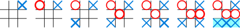

# Ruby Tic Tac Toe

> This project is a challenge on building a Tic Tac Toe game using Ruby. This is part of the _Microverse Remote Software Development Curriculum_.

### Ruby Tic Tac Toe Screenshot:


## How To Play Tic Tac Toe

In order to win the game, a player must place three of their marks in a horizontal, vertical, or diagonal row.

The following example game is won by the first player, X:



For more information: [Wikipedia Tic-Tac-Toe](https://en.wikipedia.org/wiki/Tic-tac-toe)

# Getting Started
It is recomended that you use this project with ***Ruby version 2.7.0*** and have this version already installed on your machine before you begin.

To get a local copy of the repository please run the following commands on your terminal:

```
$ cd <folder>
```

```
$ git clone git@github.com:jacobrees/Ruby-Tic-Tac-Toe.git
```

To launch an instance of this game inside of your terminal. First you will need to navigate into the repository you have just cloned. You will do this by using `cd` inside of your terminal. once you are inside of this folder run the command `bin/main.rb` and this will start the game. Below shows the following commands to run to achieve this:

```
$ cd Ruby-Tic-Tac-Toe
```

```
$ bin/main.rb
```

## Built With

- Ruby (Version - 2.7.0p0)

## Live Code

Live code link is currently unavailable as repl.it only supports Ruby version 2.5.1 (This code contains a method called difference that isn't supported in Ruby version 2.5.1, this code was built in Ruby version 2.7.0p0)

## Authors

👤 **Jacob Rees**

- Github: [@jacobrees](https://github.com/jacobrees)
- Linkedin: [jacob-rees-a6507b1a6](https://www.linkedin.com/in/jacob-rees-a6507b1a6/)

👤 **Yigit Mersin**

- Github: [@yigitm](https://github.com/yigitm)
- Linkedin: [ygtmrsn](https://www.linkedin.com/in/yigitmersin)

## 🤝 Contributing

Contributions, issues and feature requests are welcome!

## Show your support

Give a ⭐️ if you like this project!

## Acknowledgments

- Project inspired by Microverse Program
